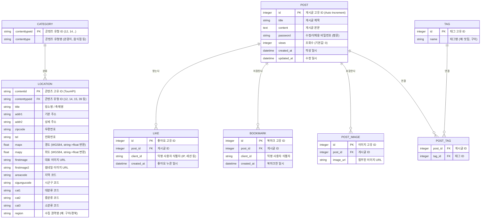

```mermaid
erDiagram
    %% ==========================================
    %% 1. 지역 정보 (Locations & Categories)
    %% ==========================================
    LOCATION {
        string contentid PK "콘텐츠 고유 ID (TourAPI)"
        string contenttypeid FK "콘텐츠 유형 ID (12, 14, 15, 39 등)"
        string title "장소명 / 축제명"
        string addr1 "기본 주소"
        string addr2 "상세 주소"
        string zipcode "우편번호"
        string tel "전화번호"
        float mapx "경도 (WGS84, string->float 변환)"
        float mapy "위도 (WGS84, string->float 변환)"
        string firstimage "대표 이미지 URL"
        string firstimage2 "썸네일 이미지 URL"
        string areacode "지역 코드"
        string sigungucode "시군구 코드"
        string cat1 "대분류 코드"
        string cat2 "중분류 코드"
        string cat3 "소분류 코드"
        string region "수집 권역명 (예: 구미/경북)"
    }

    CATEGORY {
        string contenttypeid PK "콘텐츠 유형 ID (12, 14...)"
        string contenttype "콘텐츠 유형명 (관광지, 음식점 등)"
    }

    %% ==========================================
    %% 2. 커뮤니티 핵심 기능 (Posts & Comments)
    %% ==========================================
    POST {
        integer id PK "게시글 고유 ID (Auto Increment)"
        string title "게시글 제목"
        text content "게시글 본문"
        string password "수정/삭제용 비밀번호 (평문)"
        integer views "조회수 (기본값: 0)"
        datetime created_at "작성 일시"
        datetime updated_at "수정 일시"
    }

    %% ==========================================
    %% 3. 커뮤니티 추가 기능 (Likes, Bookmarks, Tags, Images)
    %% ==========================================
    %% 익명 게시판이므로 사용자(User) ID 대신 세션 ID나 클라이언트 식별자를 임시로 사용할 수 있음.
    %% MVP 단계에서는 익명성을 고려해 게시글 자체의 카운트만 늘리거나, 식별자(client_id)를 포함.
    
    LIKE {
        integer id PK "좋아요 고유 ID"
        integer post_id FK "게시글 ID"
        string client_id "익명 사용자 식별자 (IP, 세션 등)"
        datetime created_at "좋아요 누른 일시"
    }

    BOOKMARK {
        integer id PK "북마크 고유 ID"
        integer post_id FK "게시글 ID"
        string client_id "익명 사용자 식별자"
        datetime created_at "북마크한 일시"
    }

    TAG {
        integer id PK "태그 고유 ID"
        string name "태그명 (예: 맛집, 구미)"
    }

    POST_TAG {
        integer post_id FK "게시글 ID"
        integer tag_id FK "태그 ID"
    }

    POST_IMAGE {
        integer id PK "이미지 고유 ID"
        integer post_id FK "게시글 ID"
        string image_url "첨부된 이미지 URL"
    }

    %% ==========================================
    %% 관계 정의 (Relationships)
    %% ==========================================
    
    %% 지역 데이터 관계
    CATEGORY ||--o{ LOCATION : "분류"
    
    %% 커뮤니티 관계
    POST ||--o{ LIKE : "받는다"
    POST ||--o{ BOOKMARK : "저장된다"
    POST ||--o{ POST_IMAGE : "포함한다"
    
    %% 태그 N:M 관계
    POST ||--o{ POST_TAG : "연결"
    TAG ||--o{ POST_TAG : "연결"
```